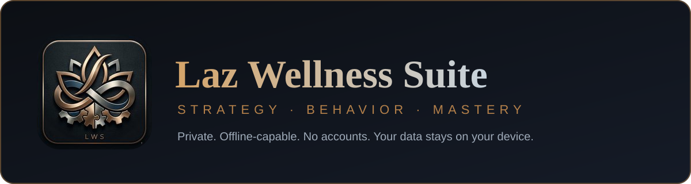
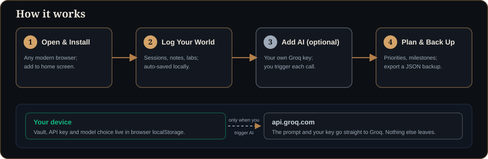

<div align="center">



[**Launch the app**](https://johnlaz.github.io/wellness/app/) &nbsp;·&nbsp; [**Landing page**](https://johnlaz.github.io/wellness/)


</div>

---

## What it is

**LWS (Laz Wellness Suite)** is a private, single-file Progressive Web App that keeps your strategy notes, session records and health tracking in one place — on your own device. No accounts, no backend, no analytics. Optional AI features use your own free [Groq](https://groq.com) API key.

| Module | What it does |
|---|---|
| **The Audit** | Structured overview of your core system: people, profiles and open gaps. |
| **Care Protocols** | Define behavioral protocols and review them against records. |
| **Personal Strategy** | Identity, priorities and a ranked priority stack. |
| **Business Strategy** | Partnership structure, equity, leverage and exit options with pros and cons. |
| **Path Forward** | Long-term options, a value statement and a milestone timeline. |
| **Session Logs** | Searchable session archive; paste a transcript and AI parses it into fields. |
| **Mediator** | Dual-session AI mediation with a history of every run. |
| **AI Chat** | In-app AI sessions with persona switching. |
| **Medical** | Symptom checker, lab interpretation and a private symptom-history vault. |

> The Medical and AI tools help you organize information and ask better questions. They are not a diagnosis and not a substitute for professional care.

<div align="center">

</div>

## Live URLs

| | |
|---|---|
| Landing page | https://johnlaz.github.io/wellness/ |
| App | https://johnlaz.github.io/wellness/app/ |

**Install:** iPhone/iPad — Share → *Add to Home Screen* · Android — browser menu → *Install app* · Desktop Chrome/Edge — install icon in the address bar.

## Repo layout

```
wellness/
├── index.html          # Landing page (links to app/ with relative paths)
├── logo.png            # Brand mark used by the landing page
├── README.md
├── docs/
│   ├── banner.svg      # README header
│   └── how-it-works.svg
└── app/
    ├── index.html      # The full suite — single-file PWA
    ├── manifest.json   # id /wellness/app/, scope ./
    ├── sw.js           # Service worker (network-first HTML, cache-first assets)
    ├── icon-192.png    # Maskable-safe icons
    ├── icon-512.png
    └── shot-*.png      # Install-prompt screenshots (sample data only)
```

Everything under `app/` uses relative paths, so renaming the repo does not break the app. Only the README links and the landing page's `canonical`/`og:` tags contain the absolute URL.

## AI & model setup

1. Open **Settings (gear) → Groq API Key** and paste a free key from [console.groq.com](https://console.groq.com).
2. On save, the app asks Groq which chat models your key can use and fills **Settings → AI Model**. Use **Refresh models** any time.
3. Non-chat models (speech, TTS, guard, embeddings, compound agents) are filtered out.

**Your saved model is never swapped automatically.** The default is `llama-3.3-70b-versatile`. If Groq stops listing the model you picked, it stays selected and is marked *no longer listed by Groq*; if Groq rejects it, you get a message telling you to pick another.

## Data & privacy

- **Vault** — saved in your browser's `localStorage` as you work. There is no server.
- **API key** — also saved in `localStorage` so it persists between sessions, and sent only to `api.groq.com`. On a shared device, clear it from the key dialog when you're done.
- **AI prompts** — sent to Groq only when you trigger an AI feature.
- **Back up** — browser storage can be cleared. Use **Export Vault (JSON)** regularly; **Import** restores it. **Reset to Blank** clears personal data and keeps the app shell.
- The repo ships a **blank** vault. Screenshots use made-up sample data.

## Deploy & update

Hosted on GitHub Pages from the `main` branch, root `/`.

1. Push to `main`; Pages rebuilds in about a minute.
2. When you change app files, bump **both** `APP_VERSION` in `app/index.html` and `VERSION` in `app/sw.js` to the same value. The footer stamp shows `APP_VERSION`; the cache name is `lws-v<VERSION>`.
3. Open installs pick up the new version on their next launch (HTML is network-first) and show a *Reload* prompt.

Moving or renaming the `/app` folder changes the install scope and requires reinstalling.

## Changelog

### v2.0
- Merged landing page and app into one repo; landing links now relative (`app/`).
- Landing copy rewritten to match the real modules and the Groq disclosure; added sample-data screenshots, favicon and social tags.
- Unified landing and app on one palette (icon bronze/silver on navy) and type pair (Playfair Display + DM Sans); tab emoji replaced by line icons.
- Model picker: shows the full chat-capable list; saved model is never auto-swapped.
- Corrected API-key copy: the key is stored in `localStorage`, not memory-only.
- Service worker: network-first HTML, cache-first assets, version-tied cache name, update prompt.
- Manifest: added `id`, trimmed to maskable-safe 192/512 icons, added screenshots.
- Added visible version stamp, dialog roles, tab roles, focus rings, Escape-to-close and reduced-motion support.
- Removed unused icon sizes, duplicate root images and the outdated `app/README.md`.

### v1
- Initial release (`lws-v1`).

---

<div align="center">

**LWS — Laz Wellness Suite** is a [LAZLAB Creations](https://johnlaz.github.io) product.<br>
© 2026 LAZLAB Creations. All Rights Reserved. · [lazlab.io@gmail.com](mailto:lazlab.io@gmail.com)

</div>
